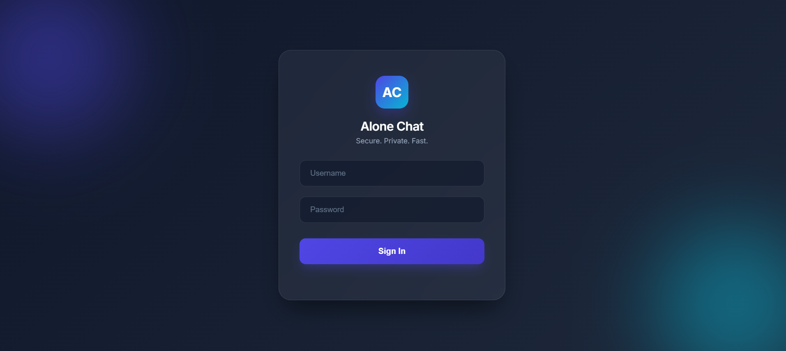

```md
<p align="center">
  
</p>

# 💬 Alone Chat  
**Secure. Private. Fast.**

🌐 **Live Demo:** https://alone-chat.onrender.com/

---

## 📌 Overview

**Alone Chat** is a private, real-time chat application built for secure communication between trusted users.  
The platform does **not** allow public sign-ups — users and groups are created and managed internally to ensure privacy, control, and safety.

The project is fully deployed using modern cloud infrastructure and backed by a production-grade database, making it suitable for real-world usage and further development.

---

## 🔐 Login Interface

<p align="center">
  
</p>

The login screen features a modern glassmorphism-inspired design focused on simplicity, accessibility, and security.

---

## 🚀 Features

### 🔐 Controlled Authentication
- No public registration
- Admin-controlled user creation
- Secure password hashing using bcrypt

### 💬 Real-Time Messaging
- One-to-one private chats
- Group conversations
- Instant message delivery using WebSockets (Socket.IO)

### 🗂️ Persistent Chat History
- Messages stored in PostgreSQL
- Automatic chat history loading

### 🟢 Online / Offline Status
- Live user presence tracking
- Instant status updates

### 🔁 Auto Session Restore
- Session persists across page refresh
- Smooth experience using browser storage

### 🎨 Modern & Responsive UI
- Clean, minimal design
- Glassmorphism login screen
- Works smoothly on desktop and mobile devices

---

## 🧱 Tech Stack

### Frontend
- HTML5  
- CSS3 (custom responsive styling)  
- Vanilla JavaScript  
- Google Fonts & Material Icons  

### Backend
- Node.js  
- Express.js  
- Socket.IO  
- bcryptjs  

### Database
- PostgreSQL  
- Neon (serverless PostgreSQL)

### Deployment
- Render (application hosting)  
- Neon (database hosting)

---

## 🌐 Live Deployment

👉 **https://alone-chat.onrender.com/**

- Backend deployed on **Render**
- Database hosted on **Neon**
- Secure environment variables used
- Fully cloud-based deployment

---

## 🔑 Test Account (For Review & Testing)

Use the credentials below to test the application:

```

Username: testing
Password: testing123

```

> Provided strictly for demonstration and review purposes.

---

## 🔄 How the System Works

1. User logs in via a WebSocket connection  
2. Server validates credentials using PostgreSQL and bcrypt  
3. User joins a private Socket.IO room  
4. Messages are stored in the database and delivered instantly  
5. Online/offline status updates in real time  
6. Session is automatically restored on refresh  

---

## 📂 Project Structure

```

alone-chat/
│
├── public/
│   ├── index.html      # Frontend UI
│   ├── style.css       # Styling
│   └── script.js       # Client-side logic
│
├── database.js         # PostgreSQL setup & schema
├── server.js           # Express + Socket.IO server
├── package.json
├── package-lock.json
└── README.md

```

---

## 🧠 What I Learned

- Designing real-time applications using WebSockets  
- Implementing secure authentication with password hashing  
- Managing sessions across browser refreshes  
- Working with cloud-hosted PostgreSQL databases  
- Debugging and deploying full-stack applications  
- Maintaining a production-ready backend  

---

## 🚧 Future Improvements

- 🔒 End-to-End Encryption  
- ✔️ Message delivery and read receipts  
- 🧾 Message editing and deletion  
- 👥 Group member management  
- 📱 Progressive Web App (PWA) support  

---

## 📜 License

This project is licensed under the **MIT License**.  
You are free to use, modify, and learn from it.

---

## 👨‍💻 Author

**elitepunith**  
Computer Science & Engineering Student  
Aspiring Cybersecurity Professional
```

---
